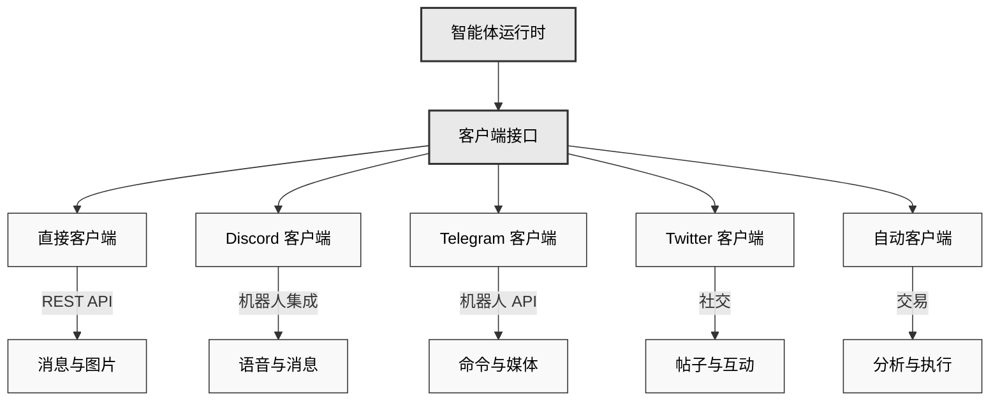

# 🔌 客户端包

## 概述
Eliza 的客户端包能够实现与各种平台和服务的集成。每个客户端都提供了一个标准化的接口，用于发送和接收消息、处理媒体内容以及与特定平台的功能进行交互。

### 架构概述


## 可用的客户端
- **Discord** (`@eliza/client-discord`) - 全面的 Discord 机器人集成
- **Twitter** (`@eliza/client-twitter`) - Twitter 机器人及交互处理
- **Telegram** (`@eliza/client-telegram`) - Telegram 机器人集成
- **直接** (`@eliza/client-direct`) - 用于自定义集成的直接 API 接口
- **自动** (`@eliza/client-auto`) - 自动化交易和交互客户端

---

## 安装
```bash
# Discord
pnpm add @eliza/client-discord

# Twitter
pnpm add @eliza/client-twitter

# Telegram
pnpm add @eliza/client-telegram

# 直接 API
pnpm add @eliza/client-direct

# 自动客户端
pnpm add @eliza/client-auto
```

---

## Discord 客户端
Discord 客户端提供了与 Discord 功能的全面集成，包括语音、反应和附件。

### 基本设置
```typescript
import { DiscordClientInterface } from "@eliza/client-discord";

// 初始化客户端
const client = await DiscordClientInterface.start(runtime);

// 在.env 中配置
DISCORD_APPLICATION_ID = 你的应用程序 ID;
DISCORD_API_TOKEN = 你的机器人令牌;
```

### 功能
- 语音频道集成
- 消息附件处理
- 反应处理
- 媒体转录
- 房间管理

### 语音集成
```typescript
class VoiceManager {
  // 加入语音频道
  async handleJoinChannelCommand(interaction) {
    await this.joinVoiceChannel(channel);
  }

  // 处理语音状态更新
  async handleVoiceStateUpdate(oldState, newState) {
    if (newState.channelId) {
      await this.handleUserJoinedChannel(newState);
    }
  }
}
```

### 消息处理
```typescript
class MessageManager {
  async handleMessage(message) {
    // 忽略机器人消息
    if (message.author.bot) return;

    // 处理附件
    if (message.attachments.size > 0) {
      await this.processAttachments(message);
    }

    // 生成回复
    await this.generateResponse(message);
  }
}
```

## Twitter 客户端
Twitter 客户端支持发布内容、搜索以及与 Twitter 用户进行交互。

### 基本设置
```typescript
import { TwitterClientInterface } from "@eliza/client-twitter";
// 初始化客户端
const client = await TwitterClientInterface.start(runtime);

// 在.env 中配置
TWITTER_USERNAME = 你的用户名;
TWITTER_PASSWORD = 你的密码;
TWITTER_EMAIL = 你的邮箱;
TWITTER_COOKIES = 你的 cookies;
```

### 组件
- **PostClient**：负责创建和管理帖子
- **SearchClient**：负责搜索功能
- **InteractionClient**：管理用户交互

### 帖子管理
```typescript
class TwitterPostClient {
  async createPost(content: string) {
    return await this.post({
      text: content,
      media: await this.processMedia(),
    });
  }

  async replyTo(tweetId: string, content: string) {
    return await this.post({
      text: content,
      reply: { in_reply_to_tweet_id: tweetId },
    });
  }
}
```

### 搜索功能
```typescript
class TwitterSearchClient {
  async searchTweets(query: string) {
    return await this.search({
      query,
      filters: {
        时效性: "最近",
        语言: "英语",
      },
    });
  }
}
```

## Telegram 客户端
Telegram 客户端为 Telegram 提供消息传递和机器人功能。

### 基本设置
```typescript
import { TelegramClientInterface } from "@eliza/client-telegram";

// 初始化客户端
const client = await TelegramClientInterface.start(runtime);

// 在.env 中配置
TELEGRAM_BOT_TOKEN = 你的机器人令牌;
```

### 消息管理
```typescript
class TelegramClient {
  async handleMessage(message) {
    // 处理消息内容
    const content = await this.processMessage(message);

    // 生成回复
    const response = await this.generateResponse(content);

    // 发送回复
    await this.sendMessage(message.chat.id, response);
  }
}
```

## 直接客户端
直接客户端为自定义集成提供了一个 REST API 接口。

### 基本设置
```typescript
import { DirectClientInterface } from "@eliza/client-direct";

// 初始化客户端
const client = await DirectClientInterface.start(runtime);
```

### API 端点
```typescript
class DirectClient {
  constructor() {
    // 消息端点
    this.app.post("/:agentId/message", async (req, res) => {
      const response = await this.handleMessage(req.body);
      res.json(response);
    });

    // 图像生成端点
    this.app.post("/:agentId/image", async (req, res) => {
      const images = await this.generateImage(req.body);
      res.json(images);
    });
  }
}
```

## 自动客户端
自动客户端支持自动化交互和交易。

### 基本设置
```typescript
import { AutoClientInterface } from "@eliza/client-auto";

// 初始化客户端
const client = await AutoClientInterface.start(runtime);
```

### 自动化交易
```typescript
class AutoClient {
  constructor(runtime: IAgentRuntime) {
    this.runtime = runtime;

    // 启动交易循环
    this.interval = setInterval(
      () => {
        this.makeTrades();
      },
      60 * 60 * 1000,
    ); // 1 小时间隔
  }

  async makeTrades() {
    // 获取推荐
    const recommendations = await this.getHighTrustRecommendations();

    // 分析代币
    const analysis = await this.analyzeTokens(recommendations);

    // 执行交易
    await this.executeTrades(analysis);
  }
}
```

## 常见功能

### 消息处理
所有客户端都实现了标准的消息处理：
```typescript
interface ClientInterface {
  async handleMessage(message: Message): Promise<void>;
  async generateResponse(context: Context): Promise<Response>;
  async sendMessage(destination: string, content: Content): Promise<void>;
}
```

### 媒体处理
```typescript
interface MediaProcessor {
  async processImage(image: Image): Promise<ProcessedImage>;
  async processVideo(video: Video): Promise<ProcessedVideo>;
  async processAudio(audio: Audio): Promise<ProcessedAudio>;
}
```

### 错误处理
```typescript
class BaseClient {
  protected async handleError(error: Error) {
    console.error("客户端错误:", error);

    if (error.code === "RATE_LIMIT") {
      await this.handleRateLimit(error);
    } else if (error.code === "AUTH_FAILED") {
      await this.refreshAuth();
    }
  }
}
```

---

## 最佳实践

1. **身份验证**
    - 将凭据安全地存储在环境变量中
    - 实现令牌刷新机制
    - 优雅地处理身份验证错误

2. **速率限制**
    - 实现指数退避策略
    - 跟踪 API 使用情况
    - 在速率限制期间对消息进行排队

3. **错误处理**
    - 记录带有上下文的错误
    - 实施重试逻辑
    - 处理特定平台的错误

4. **媒体处理**
    - 在处理媒体之前进行验证
    - 处理不同的文件格式
    - 实施大小限制

### 错误处理
```typescript
class BaseClient {
  protected async handleError(error: Error) {
    if (error.code === "RATE_LIMIT") {
      await this.handleRateLimit(error);
    } else if (error.code === "AUTH_FAILED") {
      await this.refreshAuth();
    } else if (error.code === "NETWORK_ERROR") {
      await this.reconnect();
    }

    // 记录错误
    console.error("客户端错误:", {
      类型: error.name,
      消息: error.message,
      代码: error.code,
      堆栈跟踪: error.stack,
    });
  }
}
```

### 资源管理
```typescript
class ClientManager {
  private async cleanup() {
    // 关闭连接
    await Promise.all(this.connections.map((conn) => conn.close()));

    // 清除缓存
    this.cache.clear();

    // 取消定时器
    this.timers.forEach((timer) => clearInterval(timer));
  }

  private async reconnect() {
    await this.cleanup();
    await wait(this.calculateBackoff());
    await this.initialize();
  }
}
```

### 速率限制
```typescript
class RateLimiter {
  private async handleRateLimit(error: RateLimitError) {
    const delay = this.calculateBackoff(error);
    await wait(delay);
    return this.retryRequest();
  }

  private calculateBackoff(error: RateLimitError): number {
    return Math.min(this.baseDelay * Math.pow(2, this.attempts), this.maxDelay);
  }
}
```

---

## 性能优化

### 连接管理
```typescript
class ClientManager {
  private reconnect() {
    await this.disconnect();
    await wait(this.backoff());
    await this.connect();
  }
}
```

### 消息排队
```typescript
class MessageQueue {
  async queueMessage(message: Message) {
    await this.queue.push(message);
    this.processQueue();
  }
}
```

## 故障排除

### 常见问题

1. **身份验证失败**
```typescript
// 实现令牌刷新
async refreshAuth() {
  const newToken = await this.requestNewToken();
  await this.updateToken(newToken);
}
```

2. **速率限制**
```typescript
// 处理速率限制
async handleRateLimit(error) {
  const delay = this.calculateBackoff(error);
  await wait(delay);
  return this.retryRequest();
}
```

3. **连接问题**
```typescript
// 实现重新连接逻辑
async handleDisconnect() {
  await this.reconnect({
    最大尝试次数: 5,
    退避策略: '指数型'
  });
}
```

4. **消息处理失败**
```typescript
async processMessage(message) {
  try {
    return await this.messageProcessor(message);
  } catch (error) {
    if (error.code === "INVALID_FORMAT") {
      return this.handleInvalidFormat(message);
    }
    throw error;
  }
}
```

## 相关资源
- [错误处理](./core)
