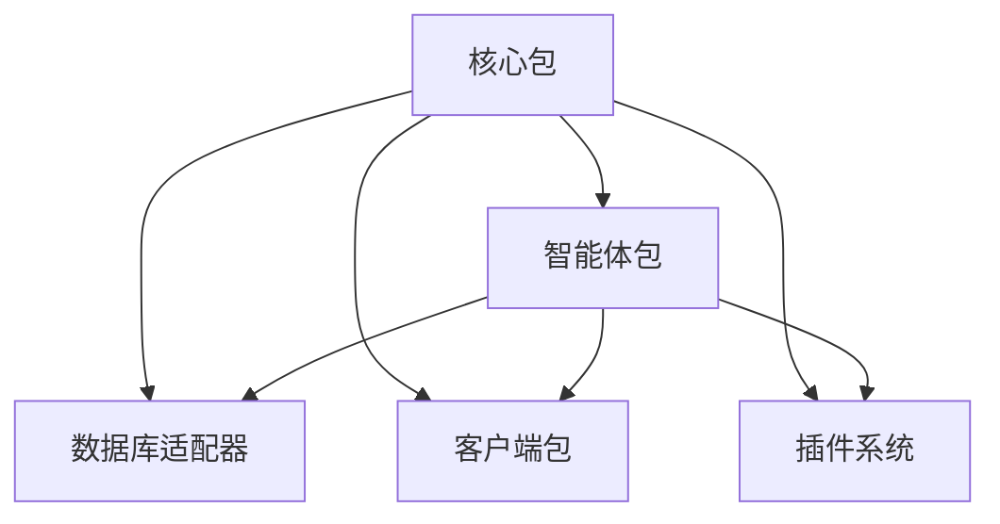

# 📖 包概述

## 核心组件
- **@ai16z/core**：核心框架与共享功能
- **@ai16z/agent**：智能体运行时与管理
- **@ai16z/adapters**：数据库实现（PostgreSQL、SQLite 等）
- **@ai16z/clients**：平台集成（Discord、Telegram 等）
- **@ai16z/plugins**：用于扩展功能的模块

## 包架构
Eliza 框架基于模块化架构构建，每个包都有特定的用途：
1. **核心包**：提供基础构建模块
2. **智能体包**：处理智能体的生命周期和运行时
3. **适配器包**：支持不同的存储后端
4. **客户端包**：连接到各种平台
5. **插件包**：添加特定功能

## 包依赖关系


## 入门指南
```
# 安装核心包
pnpm add @ai16z/core

# 安装特定的适配器
pnpm add @ai16z/adapter-postgres
pnpm add @ai16z/adapter-sqlite

# 安装客户端
pnpm add @ai16z/client-discord
pnpm add @ai16z/client-Telegram
``` 
