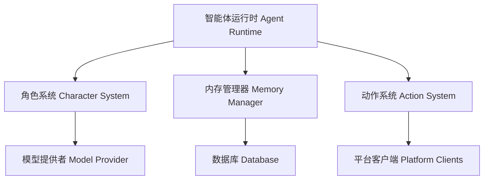

# Eliza 介绍

_Eliza 正在为 [@DegenSpartanAI](https://x.com/degenspartanai) 和 [@MarcAIndreessen](https://x.com/pmairca) 提供支持_

## 什么是 Eliza？

Eliza 是一个功能强大的多智能体模拟框架，旨在创建、部署和管理自主 AI 智能体。它基于 TypeScript 构建，为开发能够在多个平台上进行交互，同时保持一致个性和知识的智能体，提供了一个灵活且可扩展的平台。

## 关键特性

### 核心能力

- **多智能体架构**：可同时部署和管理多个独特的 AI 人格。
- **角色系统**：使用 [characterfile](https://github.com/elizaOS/characterfile) 框架创建多样化的智能体。
- **记忆管理**：先进的检索增强生成（RAG，Retrieval Augmented Generation）系统，用于长期记忆和上下文感知。
- **平台集成**：与 Discord、Twitter 及其他平台实现无缝连接。

### 通信与媒体

- **多平台支持**：
  - 全面支持 Discord 集成，包括其语音频道。
  - 具备 Twitter/X 机器人功能。
  - 支持 Telegram 集成。
  - 提供直接 API 访问。
- **媒体处理**：
  - PDF 文档读取与分析。
  - 链接内容提取与总结。
  - 音频转录。
  - 视频内容处理。
  - 图像分析与描述。
  - 对话总结。

### AI 与技术特性

- **灵活的模型支持**：
  - 使用开源模型进行本地推理。
  - 通过 OpenAI 进行基于云的推理。
  - 默认使用 Nous Hermes Llama 3.1B。
  - 与 Claude 集成以处理复杂查询。
- **技术基础**：
  - 100% 采用 TypeScript 实现。
  - 模块化架构。
  - 可扩展的动作系统。
  - 支持自定义客户端。
  - 提供全面的 API。

## 用例

Eliza 可用于创建：

1. **AI 助手**
   - 客户支持智能体
   - 社区管理员
   - 个人助手
2. **社交媒体角色**
   - 自动化内容创作者
   - 互动机器人
   - 品牌代表
3. **知识工作者**
   - 研究助手
   - 内容分析师
   - 文档处理器
4. **交互式角色**
   - 角色扮演角色
   - 教育导师
   - 娱乐机器人

## 快速上手

Eliza 在保持强大功能的同时，设计得易于使用：

- **快速入门**：从基本配置和默认角色开始。
- **自定义**：通过自定义动作和客户端扩展功能。
- **扩展**：部署具有不同个性的多个智能体。
- **集成**：连接到各种平台和服务。

查看我们的 [快速入门指南](./getting-started/quickstart.md)，开启你的 Eliza 之旅。

## 架构概述

## 社区与支持

Eliza 拥有一个活跃的开发者和用户社区：

- **开源**：在 [GitHub](https://github.com/elizaOS/eliza) 上为项目做贡献。
- **文档**：提供全面的指南和 API 参考。
- **示例**：提供即用型角色模板和实现。
- **支持**：活跃的社区可有助于解决问题和进行讨论。

## 后续步骤

- [创建你的第一个智能体](./getting-started/quickstart)
- [理解核心概念](./core/agents)
- [探索高级功能](./guides/advanced.md)

与我们一起，使用 Eliza 构建自主 AI 智能体的未来！
