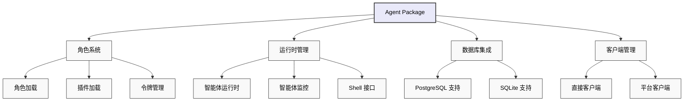

# 🤖 智能体包

## 概述

智能体包（`@eliza/agent`）为 Eliza 提供了高级编排层，负责管理智能体的生命周期、角色加载、客户端初始化以及运行时协调。

## 架构



## 主要职责
Agent 包（`@eliza/agent`）作为 Eliza 的编排层，负责以下内容：
- 角色和插件的加载。
- 运行时的初始化和管理。
- 数据库适配器的选择。
- 客户端的初始化和协调。
- 令牌和环境管理。

## 安装
```bash
pnpm add @eliza/agent
```

## 快速入门
```typescript
import { startAgents, loadCharacters } from "@eliza/agent";

// 使用默认或自定义角色启动智能体
const args = parseArguments();
const characters = await loadCharacters(args.characters);

// 初始化智能体
await startAgents();
```

## 核心组件

### 智能体创建
```typescript
export async function createAgent(
  character: Character,
  db: IDatabaseAdapter,
  token: string,
): Promise<AgentRuntime> {
  return new AgentRuntime({
    databaseAdapter: db,
    token,
    modelProvider: character.modelProvider,
    character,
    plugins: [
      bootstrapPlugin,
      nodePlugin,
      // 条件插件
      character.settings.secrets.WALLET_PUBLIC_KEY? solanaPlugin : null,
    ].filter(Boolean),
    providers: [],
    actions: [],
    services: [],
    managers: [],
  });
}
```

### 角色加载
```typescript
export async function loadCharacters(
  charactersArg: string,
): Promise<Character[]> {
  // 解析角色路径
  let characterPaths = charactersArg
  ?.split(",")
   .map((path) => path.trim())
   .map((path) => normalizePath(path));

  const loadedCharacters = [];

  // 加载每个角色文件
  for (const path of characterPaths) {
    try {
      const character = JSON.parse(fs.readFileSync(path, "utf8"));

      // 如果指定了插件，则加载插件
      if (character.plugins) {
        character.plugins = await loadPlugins(character.plugins);
      }

      loadedCharacters.push(character);
    } catch (error) {
      console.error(`从 ${path} 加载角色时出错: ${error}`);
    }
  }

  // 如果没有加载任何角色，则回退到默认角色
  if (loadedCharacters.length === 0) {
    loadedCharacters.push(defaultCharacter);
  }

  return loadedCharacters;
}
```

### 客户端初始化
```typescript
export async function initializeClients(
  character: Character,
  runtime: IAgentRuntime,
) {
  const clients = [];
  const clientTypes = character.clients?.map((str) => str.toLowerCase()) || [];

  if (clientTypes.includes(Clients.DISCORD)) {
    clients.push(await DiscordClientInterface.start(runtime));
  }
  if (clientTypes.includes(Clients.TELEGRAM)) {
    clients.push(await TelegramClientInterface.start(runtime));
  }
  if (clientTypes.includes(Clients.TWITTER)) {
    clients.push(await TwitterClientInterface.start(runtime));
  }
  if (clientTypes.includes(Clients.DIRECT)) {
    clients.push(await AutoClientInterface.start(runtime));
  }

  return clients;
}
```

## 数据库管理
```typescript
function initializeDatabase(): IDatabaseAdapter {
  // 如果提供了 URL，则使用 PostgreSQL
  if (process.env.POSTGRES_URL) {
    return new PostgresDatabaseAdapter({
      connectionString: process.env.POSTGRES_URL,
    });
  }

  // 回退到 SQLite
  return new SqliteDatabaseAdapter(new Database("./db.sqlite"));
}
```

## 令牌管理
```typescript
export function getTokenForProvider(
  provider: ModelProviderName,
  character: Character,
) {
  switch (provider) {
    case ModelProviderName.OPENAI:
      return (
        character.settings?.secrets?.OPENAI_API_KEY || settings.OPENAI_API_KEY
      );

    case ModelProviderName.ANTHROPIC:
      return (
        character.settings?.secrets?.ANTHROPIC_API_KEY ||
        character.settings?.secrets?.CLAUDE_API_KEY ||
        settings.ANTHROPIC_API_KEY
      );

    // 处理其他提供商...
  }
}
```

## 智能体生命周期管理

### 启动智能体
```typescript
async function startAgent(character: Character, directClient: any) {
  try {
    // 获取提供商令牌
    const token = getTokenForProvider(character.modelProvider, character);

    // 初始化数据库
    const db = initializeDatabase();

    // 创建运行时
    const runtime = await createAgent(character, db, token);

    // 初始化客户端
    const clients = await initializeClients(character, runtime);

    // 向直接客户端注册
    directClient.registerAgent(runtime);

    return clients;
  } catch (error) {
    console.error(
      `启动角色为 ${character.name} 的智能体时出错:`,
      error,
    );
    throw error;
  }
}
```

### 命令行界面
```typescript
const rl = readline.createInterface({
  input: process.stdin,
  output: process.stdout,
});

async function handleUserInput(input, agentId) {
  if (input.toLowerCase() === "exit") {
    rl.close();
    return;
  }

  try {
    const response = await fetch(
      `http://localhost:${serverPort}/${agentId}/message`,
      {
        method: "POST",
        headers: {
          "Content-Type": "application/json",
        },
        body: JSON.stringify({
          text: input,
          userId: "user",
          userName: "User",
        }),
      },
    );

    const data = await response.json();
    data.forEach((message) => console.log(`智能体: ${message.text}`));
  } catch (error) {
    console.error("错误:", error);
  }
}
```

## 高级功能

### 插件管理
```typescript
async function loadPlugins(pluginPaths: string[]) {
  return await Promise.all(
    pluginPaths.map(async (plugin) => {
      const importedPlugin = await import(plugin);
      return importedPlugin;
    }),
  );
}
```

### 角色热重载
```typescript
async function reloadCharacter(runtime: IAgentRuntime, characterPath: string) {
  // 加载新角色
  const character = JSON.parse(fs.readFileSync(characterPath, "utf8"));

  // 更新运行时
  runtime.character = character;

  // 重新加载插件
  if (character.plugins) {
    const plugins = await loadPlugins(character.plugins);
    runtime.registerPlugins(plugins);
  }
}
```

### 多智能体协调
```typescript
class AgentCoordinator {
  private agents: Map<string, IAgentRuntime>;

  async broadcast(message: Memory) {
    const responses = await Promise.all(
      Array.from(this.agents.values()).map((agent) =>
        agent.processMessage(message),
      ),
    );
    return responses;
  }

  async coordinate(agents: string[], task: Task) {
    // 协调多个智能体完成一项任务
    const selectedAgents = agents.map((id) => this.agents.get(id));

    return await this.executeCoordinatedTask(selectedAgents, task);
  }
}
```

## 最佳实践

### 角色管理
```typescript
// 加载角色前验证角色
function validateCharacter(character: Character) {
  if (!character.name) {
    throw new Error("角色必须有一个名称");
  }

  if (!character.modelProvider) {
    throw new Error("必须指定模型提供商");
  }
}

// 使用角色版本控制
const character = {
  name: "智能体",
  version: "1.0.0",
  //...
};
```

### 错误处理
```typescript
async function handleAgentError(error: Error, character: Character) {
  // 记录带有上下文的错误
  console.error(`智能体 ${character.name} 出错:`, error);

  // 尝试恢复
  if (error.code === "TOKEN_EXPIRED") {
    await refreshToken(character);
  }

  // 通知监控
  await notify({
    level: "错误",
    角色: character.name,
    error,
  });
}
```

### 资源管理
```typescript
class ResourceManager {
  async cleanup() {
    // 关闭数据库连接
    await this.db.close();

    // 关闭客户端
    await Promise.all(this.clients.map((client) => client.stop()));

    // 清除缓存
    this.cache.clear();
  }

  async monitor() {
    // 监控资源使用情况
    const usage = process.memoryUsage();
    if (usage.heapUsed > 阈值) {
      await this.cleanup();
    }
  }
}
```

## 故障排除

### 常见问题

1. **角色加载失败**
```typescript
try {
  await loadCharacters(charactersArg);
} catch (error) {
  if (error.code === "ENOENT") {
    console.error("角色文件未找到");
  } else if (error instanceof SyntaxError) {
    console.error("无效的角色 JSON");
  }
}
```

2. **客户端初始化错误**
```typescript
async function handleClientError(error: Error) {
  if (error.message.includes("速率限制")) {
    await等待(exponentialBackoff());
  } else if (error.message.includes("认证")) {
    await刷新认证();
  }
}
```

3. **数据库连接问题**
```typescript
async function handleDbError(error: Error) {
  if (error.message.includes("连接")) {
    await重新连接数据库();
  } else if (error.message.includes("锁定")) {
    await等待解锁();
  }
}
```

## 相关资源
- [角色创建指南](../core/characters)
- [客户端配置](./clients)
- [插件开发](./plugins)
